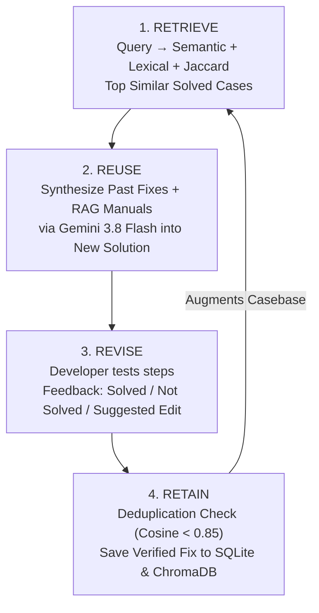
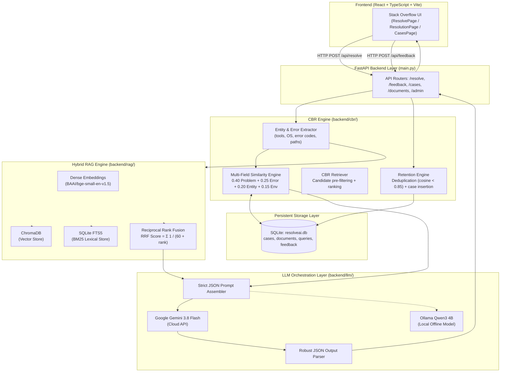

# ResolveAI: Comprehensive System Architecture & Engineering Explainer

> **Project Title:** ResolveAI: An Explainable Technical Troubleshooting Assistant Using Hybrid Retrieval-Augmented Generation (RAG), Case-Based Reasoning (CBR), and Dual Large Language Models  
> **Academic Context:** Major Project — Computer Science & Engineering (7th / 8th Semester)  
> **Based on Research:** *"CBR-RAG: Case-Based Reasoning for Retrieval Augmented Generation in LLMs for Legal Question Answering"* (ArXiv: 2404.04302)  
> **Primary Technology Stack:** Python (FastAPI, SQLite FTS5, ChromaDB, Sentence-Transformers), React (TypeScript, Vite, Stack Overflow Design System), Google Gemini 3.8 Flash / Ollama Qwen.

---

## Table of Contents
1. [Executive Summary & Core Motivation](#1-executive-summary--core-motivation)
2. [Theoretical Foundation: Why RAG + CBR?](#2-theoretical-foundation-why-rag--cbr)
3. [The Complete 4R CBR Cycle](#3-the-complete-4r-cbr-cycle)
4. [High-Level System Architecture](#4-high-level-system-architecture)
5. [Deep Dive into Backend Modules](#5-deep-dive-into-backend-modules)
   - [5.1 Entity & Error Extraction Engine](#51-entity--error-extraction-engine)
   - [5.2 Case-Based Reasoning (CBR) Similarity Engine](#52-case-based-reasoning-cbr-similarity-engine)
   - [5.3 Hybrid RAG Pipeline (Dense + Sparse + RRF)](#53-hybrid-rag-pipeline-dense--sparse--rrf)
   - [5.4 LLM Orchestration & Zero-Hallucination Prompting](#54-llm-orchestration--zero-hallucination-prompting)
   - [5.5 Retention & Continuous Learning Engine](#55-retention--continuous-learning-engine)
6. [Database Schema & Storage Architecture](#6-database-schema--storage-architecture)
7. [API Endpoints & Request-Response Lifecycles](#7-api-endpoints--request-response-lifecycles)
8. [Frontend Design & Stack Overflow Aesthetics](#8-frontend-design--stack-overflow-aesthetics)
9. [Experimental Ablation Study (Viva Ready)](#9-experimental-ablation-study-viva-ready)
10. [Frequently Asked Viva / Interview Questions](#10-frequently-asked-viva--interview-questions)

---

## 1. Executive Summary & Core Motivation

### The Problem
When software developers, students, or DevOps engineers encounter command-line errors (in Python, `pip`, virtual environments, Git, or Docker), standard troubleshooting suffers from three major failure modes:
1. **Generic LLMs (ChatGPT / Copilot) Hallucinate:** Out-of-the-box LLMs frequently hallucinate CLI flags, recommend outdated versions, or worse, suggest dangerous system commands (e.g., `sudo chmod -R 777 /` or forced deletions) without verifiable provenance.
2. **Standard RAG (Documentation Only) is Too Academic:** Official manuals explain how tools *should* work under ideal conditions. They rarely document messy, real-world edge cases (e.g., PATH conflicts on Windows, corrupted wheels, or subtle permission collisions).
3. **Forum Searching (Stack Overflow / GitHub Issues) is Unstructured:** Finding an accepted answer requires wading through dozens of obsolete answers, conflicting operating system contexts, and fragmented comments.

### The Solution: ResolveAI
ResolveAI bridges this gap by combining **two complementary knowledge sources**:
- **Authoritative Documentation (RAG):** The official "rulebook" or technician manual that guarantees factual accuracy and verifiable citations.
- **Reviewed Solved Cases (CBR):** A structured memory of real, previously resolved tickets and edge cases (the "experienced senior engineer's memory").
- **Grounded LLM (Gemini 3.8 Flash / Local Ollama):** Synthesizes both inputs into an ordered, explainable, step-by-step checklist with safety warnings and source citations.

```
┌─────────────────────────────────────────────────────────────────────────┐
│                           RESOLVEAI ANALOGY                             │
├───────────────────┬────────────────────────────┬────────────────────────┤
│ Component         │ Real-World Analogy         │ Core Responsibility    │
├───────────────────┼────────────────────────────┼────────────────────────┤
│ RAG               │ Official Workshop Manual   │ Authoritative facts    │
│ CBR               │ Master Mechanic's Logbook  │ Real-world experience  │
│ LLM (Gemini 3.8)  │ Explainer / Communicator   │ Adaptive synthesis     │
│ Feedback Loop     │ Quality Control Gatekeeper │ Verified retention     │
└───────────────────┴────────────────────────────┴────────────────────────┘
```

---

## 2. Theoretical Foundation: Why RAG + CBR?

The project is inspired by the research paper *"CBR-RAG: Case-Based Reasoning for Retrieval Augmented Generation in LLMs for Legal Question Answering"*. While the original paper applied CBR-RAG to Australian legal statutes, ResolveAI adapts the methodology to **technical software troubleshooting**, where support tickets naturally form structured cases.

### Core Comparison Matrix

| Feature | Standard RAG | Classical CBR | ResolveAI (Hybrid CBR-RAG) |
| :--- | :--- | :--- | :--- |
| **Knowledge Representation** | Unstructured document chunks | Structured cases: `<Problem, Solution>` | **Both:** Official docs + structured cases |
| **Retrieval Strategy** | Single query-to-passage vector similarity | Attribute / rule-based distance | **Multi-vector + BM25 + Multi-field Jaccard** |
| **Adaptation** | Relies entirely on LLM | Manual rule-based adaptation | **Context-grounded LLM synthesis** |
| **Hallucination Risk** | Moderate | Zero (retrieves raw case) | **Very Low (Citations + strict JSON schema)** |
| **Continuous Learning** | Static (requires re-embedding docs) | Dynamic case retention | **Human-in-the-loop retention gate** |

---

## 3. The Complete 4R CBR Cycle

The original research paper only implemented **Retrieve** and a loose form of **Reuse**, omitting systematic revision and retention. ResolveAI implements the **complete, classical 4R CBR cycle**:



1. **Retrieve:** When a developer submits an issue (e.g. `pip install fails with PermissionError on Windows 11`), ResolveAI extracts entities and calculates transparent multi-field similarity across all cases in the database.
2. **Reuse:** The LLM receives the top retrieved cases and authoritative manual passages, adapting the historical solution to the user's specific OS, tool version, and traceback.
3. **Revise:** The developer attempts the steps and provides structured feedback:
   - Upvote / Downvote (Rating).
   - "Resolved" vs. "Need More Help".
   - *Optional:* Submits a revised or corrected command that worked in their environment.
4. **Retain (Continuous Learning Gate):** If the resolution is verified (or a correction is provided), the **Retention Engine** checks for near-duplicates (cosine similarity threshold = 0.85). If unique, it automatically creates a new verified case in the SQLite database and updates the BM25 full-text search index.

> [!IMPORTANT]
> **Quality Rule:** Automatically generated LLM answers are **never** retained blindly. Only human-reviewed and verified resolutions enter the casebase, preventing error cascades.

---

## 4. High-Level System Architecture



---

## 5. Deep Dive into Backend Modules

### 5.1 Entity & Error Extraction Engine (`backend/cbr/entity_extractor.py`)
Before search or retrieval begins, raw user text and error logs are parsed to extract structured technical indicators:
- **Tools:** Regex extraction matching `python`, `pip`, `venv`, `virtualenv`, `poetry`, `conda`, `git`, `docker`.
- **Operating Systems:** Detects Windows, Linux (Ubuntu, Debian, Arch, CentOS), and macOS.
- **Python Error Types:** Regex patterns detecting standard exceptions (`ModuleNotFoundError`, `ImportError`, `PermissionError`, `SyntaxError`, `AttributeError`, `RecursionError`, `FileNotFoundError`, etc.).
- **Git Error Phrases:** Matches `refusing to merge unrelated histories`, `merge conflict`, `detached HEAD`, `fatal: not a git repository`, `Permission denied (publickey)`.
- **File Paths & Commands:** Parses paths (`C:\...`, `/usr/bin/...`, `.venv/...`) and CLI invocations (`pip install`, `git checkout`, `python -m`).

---

### 5.2 Case-Based Reasoning (CBR) Similarity Engine (`backend/cbr/similarity.py`)
Unlike generic chatbots that perform a single vector search, ResolveAI computes a **transparent, multi-field weighted score** across four distinct components:

$$\text{Total Score} = w_{\text{problem}} \cdot S_{\text{problem}} + w_{\text{evidence}} \cdot S_{\text{evidence}} + w_{\text{entity}} \cdot S_{\text{entity}} + w_{\text{env}} \cdot S_{\text{env}}$$

#### Default Configurable Weights:
1. **Problem Semantic Similarity ($w_{\text{problem}} = 0.40$):**
   - Embeds user problem query using `BAAI/bge-small-en-v1.5` (384 dimensions).
   - Computes Cosine Similarity against historical case problem embeddings:
     $$\text{Cosine}(u, v) = \frac{u \cdot v}{\|u\|_2 \|v\|_2}$$
2. **Evidence & Error Similarity ($w_{\text{evidence}} = 0.25$):**
   - Compares query error log / symptoms against the case's `error_code` and `symptoms` field via cosine semantic similarity.
3. **Entity & Identifier Overlap ($w_{\text{entity}} = 0.20$):**
   - Computes set-theoretic **Jaccard Similarity** between extracted entities (error tokens, package names, command tokens):
     $$J(A, B) = \frac{|A \cap B|}{|A \cup B|}$$
4. **Environment & Tool Match ($w_{\text{env}} = 0.15$):**
   - Exact tool match yields `1.0`; partial substring yields `0.5`.
   - Exact OS match yields `1.0`; partial yields `0.5`.
   - Combined as: $0.6 \cdot \text{ToolScore} + 0.4 \cdot \text{OSScore}$.

Every single component score is returned in the API response and displayed to the user as an inspectable score breakdown bar!

---

### 5.3 Hybrid RAG Pipeline (`backend/rag/`)
To retrieve official manual passages, ResolveAI runs **Hybrid Retrieval (Dense + Sparse)**:

1. **Chunking (`rag/chunker.py`):**
   - Markdown documents are segmented into chunks of ~500 characters with 100-character overlap.
   - Header metadata (`#`, `##`, `###`) is preserved so chunks maintain section context.
2. **Dense Semantic Retrieval (`rag/embeddings.py`):**
   - Chunks are vectorized using the local `BAAI/bge-small-en-v1.5` model and queried in persistent **ChromaDB**.
3. **Sparse Lexical Retrieval (`db/database.py`):**
   - The query is matched against SQLite **FTS5** virtual tables implementing **BM25 (Best Matching 25)**. This guarantees exact keyword, flag, and error-code hits.
4. **Reciprocal Rank Fusion — RRF (`rag/retriever.py`):**
   - Merges the ranked lists from ChromaDB and SQLite FTS5 using the formula:
     $$\text{RRF Score}(d) = \sum_{m \in \{\text{dense}, \text{sparse}\}} \frac{1}{k + r_m(d)} \quad (k = 60)$$
   - Items appearing in both lists receive significantly higher composite ranking.

---

### 5.4 LLM Orchestration & Zero-Hallucination Prompting (`backend/llm/orchestrator.py`)
The LLM orchestrator formats the prompt into strict sections:
1. **User's Problem:** Description, tool, OS, version, and formatted error log.
2. **Official Documentation Evidence:** Top 5 RRF-fused manual chunks with source and relevance scores.
3. **Similar Past Solved Cases:** Top 3-5 CBR cases with match score breakdown and previous verified solutions.

#### System Prompt Enforcement:
- Mandates valid JSON output.
- Instructs the model: *"Base your answer ONLY on the provided documentation evidence and similar cases. Do NOT fabricate information."*
- Requires explicit confidence scoring (`high`, `medium`, `low`).
- Generates safety warnings for potentially destructive operations (e.g., `git reset --hard`, `rm -rf`).

#### Supported Dual LLM Providers:
- **Cloud:** Google Gemini 3.8 Flash (`gemini-flash-latest` pointer via `google-genai` SDK).
- **Local / Offline:** Ollama running `qwen3:4b` (or `qwen2.5-coder:1.5b` for low-RAM machines).

---

### 5.5 Retention & Continuous Learning Engine (`backend/cbr/retention.py`)
When feedback is received:
1. If the user marks an issue as solved or inputs a corrected command, `retain_case_from_feedback()` is invoked.
2. **Deduplication:** Computes cosine similarity against all existing cases. If $\text{sim} \ge 0.85$, it rejects insertion to prevent polluting the casebase.
3. **Auto-Case Creation:** Extracts structured fields (`problem`, `tool`, `os`, `verified_solution`, `outcome: solved`, `status: verified`) and persists to SQLite. SQLite triggers automatically update the `cases_fts` search index.

---

## 6. Database Schema & Storage Architecture

All structured application data is stored in **SQLite (`data/resolveai.db`)** with zero external database dependencies:

```sql
-- 1. CBR Casebase
CREATE TABLE cases (
    id                  TEXT PRIMARY KEY,
    problem             TEXT NOT NULL,
    tool                TEXT DEFAULT '',
    operating_system    TEXT DEFAULT '',
    version             TEXT DEFAULT '',
    error_code          TEXT DEFAULT '',
    symptoms            TEXT DEFAULT '',
    attempted_steps     TEXT DEFAULT '',
    supporting_evidence TEXT DEFAULT '',
    verified_solution   TEXT DEFAULT '',
    outcome             TEXT DEFAULT 'solved',
    source_url          TEXT DEFAULT '',
    verification_status TEXT DEFAULT 'pending',
    created_at          DATETIME DEFAULT CURRENT_TIMESTAMP
);

-- 2. Full-Text Search (BM25) Virtual Table for Cases
CREATE VIRTUAL TABLE cases_fts USING fts5(
    problem, error_code, symptoms, verified_solution,
    content='cases', content_rowid='rowid'
);

-- 3. Document Metadata
CREATE TABLE documents (
    id          TEXT PRIMARY KEY,
    title       TEXT NOT NULL,
    source      TEXT DEFAULT '',
    url         TEXT DEFAULT '',
    chunk_count INTEGER DEFAULT 0,
    ingested_at DATETIME DEFAULT CURRENT_TIMESTAMP
);

-- 4. Document Chunks for BM25 Search
CREATE TABLE document_chunks (
    id          TEXT PRIMARY KEY,
    doc_id      TEXT NOT NULL REFERENCES documents(id),
    content     TEXT NOT NULL,
    title       TEXT DEFAULT '',
    source      TEXT DEFAULT '',
    url         TEXT DEFAULT '',
    chunk_index INTEGER DEFAULT 0
);
CREATE VIRTUAL TABLE chunks_fts USING fts5(
    content, title, source, content='document_chunks', content_rowid='rowid'
);

-- 5. Query Audit History
CREATE TABLE queries (
    id           TEXT PRIMARY KEY,
    problem_text TEXT NOT NULL,
    tool         TEXT DEFAULT '',
    os           TEXT DEFAULT '',
    error_log    TEXT DEFAULT '',
    llm_provider TEXT DEFAULT '',
    response     TEXT DEFAULT '',
    rag_results  TEXT DEFAULT '[]',
    cbr_results  TEXT DEFAULT '[]',
    created_at   DATETIME DEFAULT CURRENT_TIMESTAMP
);

-- 6. User Feedback Loop
CREATE TABLE feedback (
    id                 TEXT PRIMARY KEY,
    query_id           TEXT NOT NULL REFERENCES queries(id),
    resolved           BOOLEAN NOT NULL,
    corrected_solution TEXT DEFAULT '',
    rating             INTEGER,
    created_at         DATETIME DEFAULT CURRENT_TIMESTAMP
);
```

---

## 7. API Endpoints & Request-Response Lifecycles

| Method | Path | Description | Key Parameters |
| :--- | :--- | :--- | :--- |
| `POST` | `/api/resolve` | Core troubleshooting endpoint | `problem`, `tool`, `os`, `error_log`, `mode` (`full`/`rag_only`/`cbr_only`/`llm_only`), `provider` |
| `POST` | `/api/feedback` | Submit resolution feedback & trigger retention | `query_id`, `resolved` (bool), `rating` (1-5), `corrected_solution` |
| `GET` | `/api/cases` | Search & browse CBR casebase | `q`, `tool`, `operating_system`, `verification_status`, `limit` |
| `GET` | `/api/cases/{id}` | Inspect full case details | Case ID |
| `GET` | `/api/cases/stats` | Aggregated case counts by tool/OS | None |
| `GET` | `/api/documents` | List indexed RAG documentation | None |
| `POST` | `/api/documents/ingest` | Upload & ingest new `.md`/`.txt` manual | File upload |
| `GET` | `/api/admin/health` | Comprehensive health check | Checks Ollama, Gemini, Chroma, SQLite |
| `GET` | `/api/admin/config` | View active config & weights | None |
| `PATCH` | `/api/admin/config` | Update LLM provider, API key, weights | Config JSON payload |
| `POST` | `/api/admin/test-llm` | Test live inference latency | `provider=gemini` or `ollama` |

---

## 8. Frontend Design & Stack Overflow Aesthetics

The user interface was built to mirror **Stack Overflow's iconic developer aesthetic**:

1. **Header:**
   - Characteristic orange top border (`3px solid #f48225`).
   - Stacked icon logo with `ResolveAI` and `Hybrid RAG+CBR` badge.
   - Global search input with shortcut hint `[ / ]`.
   - Real-time LLM status pill (`Gemini Flash Active`).
2. **Left Navigation Sidebar:**
   - Sections for `PUBLIC` (Troubleshoot, Questions/Cases, CBR Memory), `KNOWLEDGE BASE` (RAG Manuals), and `SYSTEM` (Admin & Metrics).
3. **Ask a Question Wizard (`ResolvePage.tsx`):**
   - Blue guidance banner outlining how to format error logs.
   - Card inputs for Title, Environment (Tool/OS), Terminal Traceback, and Stack Overflow tag pills (`[pip]`, `[windows]`, `[python]`).
   - Engine configuration controls (toggle ablation modes and LLMs).
4. **Resolution View (`ResolutionPage.tsx`):**
   - Upvote / Downvote column with **Accepted Solution Green Badge (`✓ Accepted Solution`)**.
   - Clear root-cause Diagnosis card.
   - Ordered step-by-step checklist with syntax-formatted terminal blocks and one-click copy buttons.
   - Expandable documentation citations with official URLs.
   - Right sidebar linking related solved cases with match percentages.
5. **Cases Feed (`CasesPage.tsx`):**
   - Matches Stack Overflow's questions list: stats column (`0 votes`, `✓ 1 answer`, `24 views`), blue link title, symptom excerpt, and author signature.

---

## 9. Experimental Ablation Study (Viva Ready)

For Major Project defense and academic evaluation, ResolveAI includes built-in **system ablation modes** via the `mode` query parameter:

```
                  ┌──────────────────────────────────────────────────────────┐
                  │                 RESOLVEAI ABLATION MODES                 │
                  └──────────────────────────────────────────────────────────┘

       Mode: "llm_only"                Mode: "rag_only"                Mode: "cbr_only"              Mode: "full"
    ┌────────────────────┐          ┌────────────────────┐          ┌────────────────────┐        ┌────────────────────┐
    │     Query Text     │          │ Query + RAG Docs   │          │ Query + CBR Cases  │        │ Query + Docs + CBR │
    └─────────┬──────────┘          └─────────┬──────────┘          └─────────┬──────────┘        └─────────┬──────────┘
              │                               │                               │                             │
              ▼                               ▼                               ▼                             ▼
    ┌────────────────────┐          ┌────────────────────┐          ┌────────────────────┐        ┌────────────────────┐
    │     LLM Direct     │          │   Grounded by      │          │   Grounded by      │        │    Full Hybrid     │
    │  (No Evidence)     │          │     Manuals        │          │   Case Memory      │        │    Resolution      │
    └────────────────────┘          └────────────────────┘          └────────────────────┘        └────────────────────┘
```

1. **`llm_only` (Baseline):** The LLM answers directly from training memory without retrieval. Used to quantify hallucination rate and generic advice.
2. **`rag_only`:** Retrieves only official documentation manuals. Used to measure accuracy when only abstract rules are present without past tickets.
3. **`cbr_only`:** Retrieves only past solved tickets. Used to measure accuracy when only historical experiences are available without authoritative specs.
4. **`full` (Hybrid CBR-RAG):** Combines both sources. Demonstrates the paper's core hypothesis: **combining authoritative manuals with past solved cases produces the highest diagnostic precision, lowest hallucination rate, and most actionable steps.**

---

## 10. Frequently Asked Viva / Interview Questions

### Q1: Why not just use ChatGPT or standard RAG?
> **Answer:** Standard RAG only retrieves static documentation chunks. If you search for a complex Python packaging error, the documentation only explains standard installation procedures—it does not explain the exact workaround for your specific OS or corrupted dependency collision. CBR provides genuine technician experience from previous solved tickets. ResolveAI combines both: RAG ensures the solution complies with official standards, while CBR provides the battle-tested fix.

### Q2: How is CBR similarity calculated? Why not just use vector search?
> **Answer:** Pure vector search collapses all text into a single embedding, often losing critical technical distinctions like operating system differences or specific exit codes. ResolveAI computes a **transparent, multi-field weighted score**:
> - 40% semantic problem similarity (vector cosine)
> - 25% error log / symptom similarity (vector cosine)
> - 20% entity and error-code overlap (Jaccard similarity on tokens)
> - 15% exact environment and tool matching (exact match)  
> Every component is individually inspectable in the UI, making the reasoning explainable.

### Q3: How do you prevent the LLM from hallucinating dangerous commands?
> **Answer:** We enforce three safeguards:
> 1. In-context retrieval grounding: The prompt instructs the model to rely *only* on provided citations.
> 2. Strict JSON output validation: Ensures steps, warnings, and citations follow an exact schema.
> 3. Safety heuristic warnings: Destructive commands (e.g. forced deletion, permission altering) trigger mandatory warning badges in the output.

### Q4: How is the 4R CBR cycle completed?
> **Answer:** The original research paper only implemented Retrieve and Reuse. ResolveAI completes the loop:
> - **Revise:** The developer tests the solution and submits feedback or a corrected command.
> - **Retain:** The retention engine checks that the fix is not a near-duplicate ($\text{sim} < 0.85$) and stores it as a verified case in SQLite, dynamically updating the casebase for future queries without re-training.
